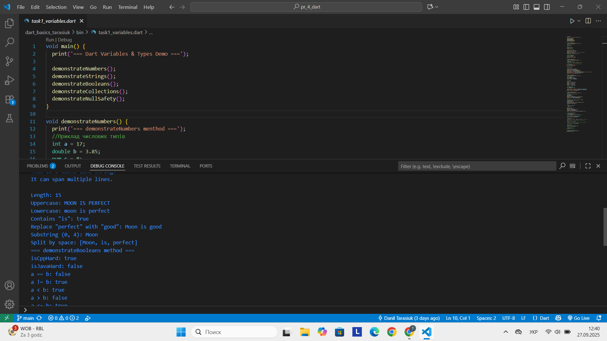
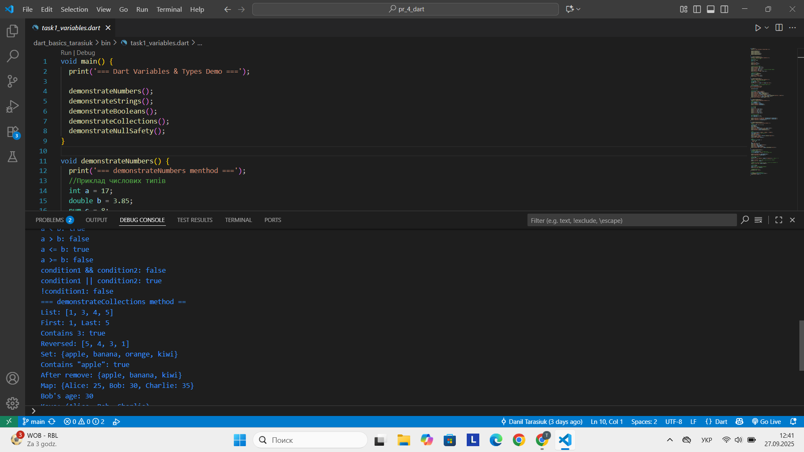
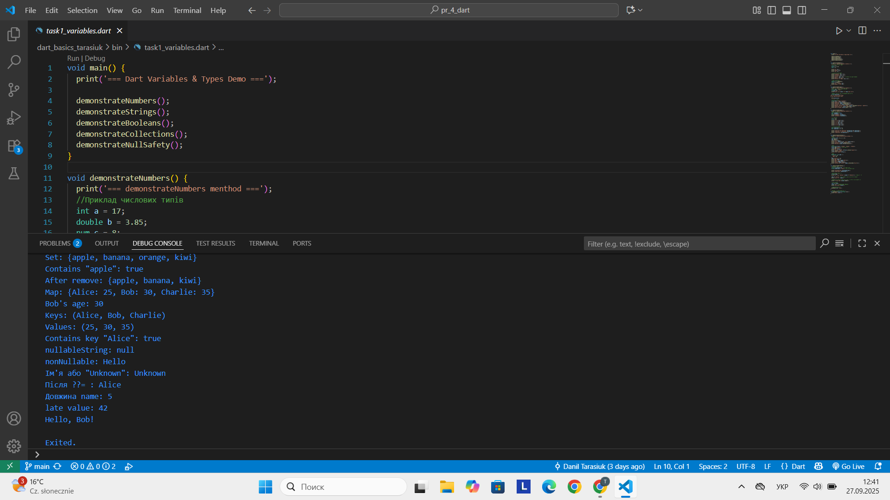
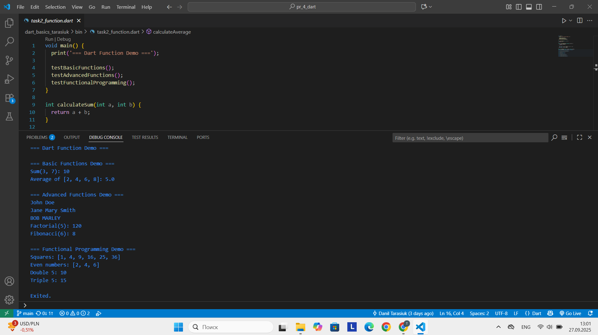
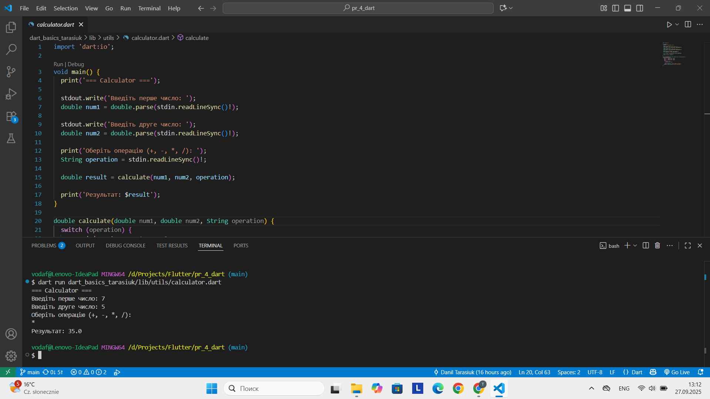
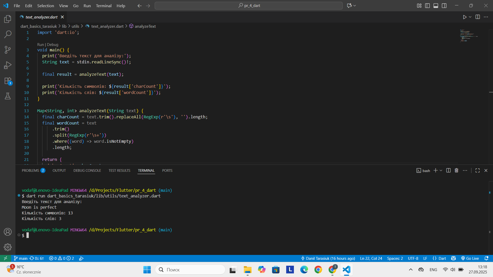
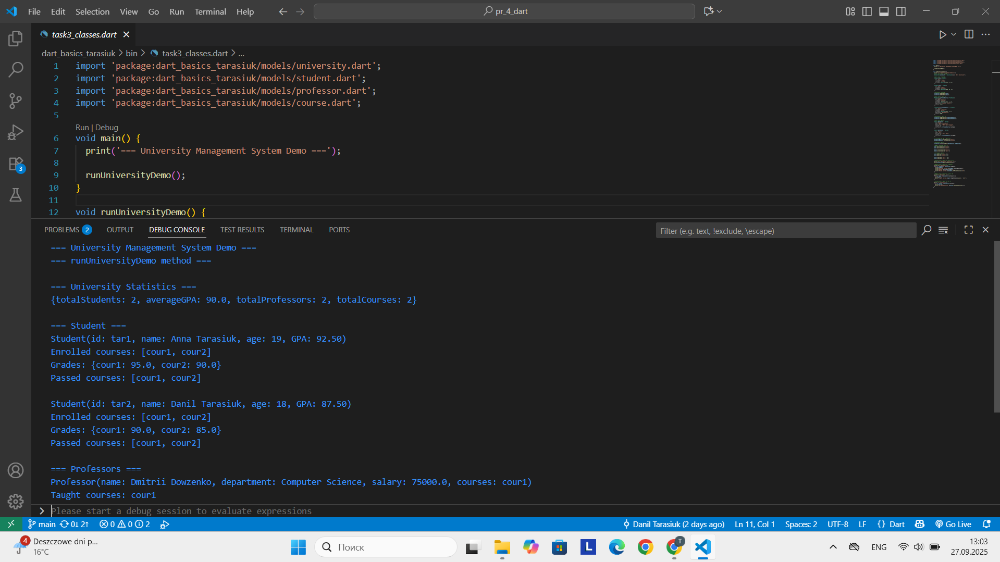
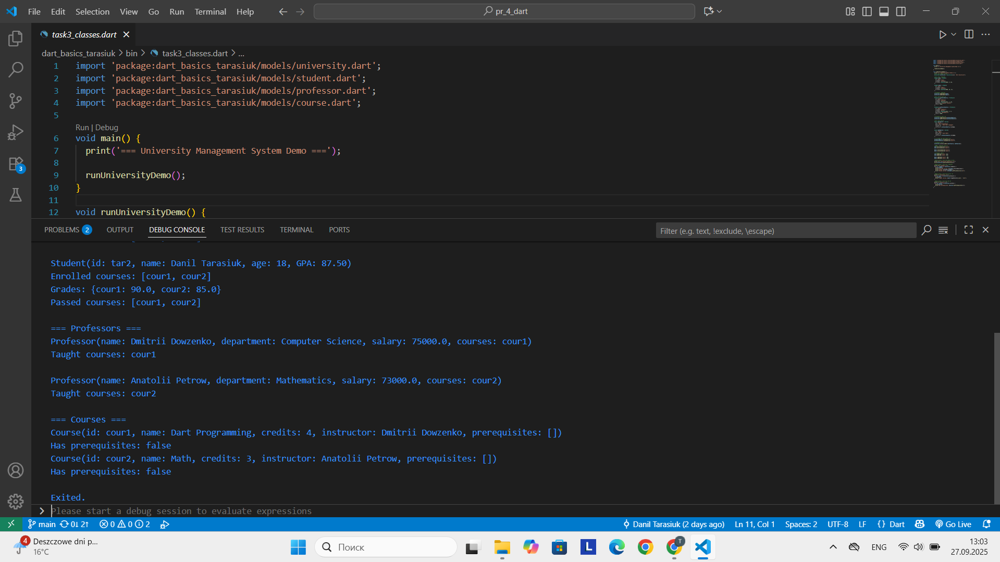
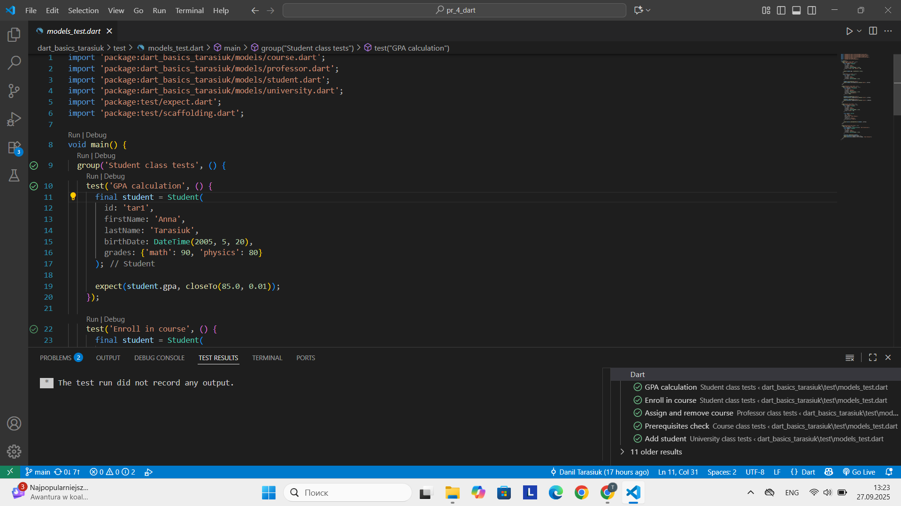
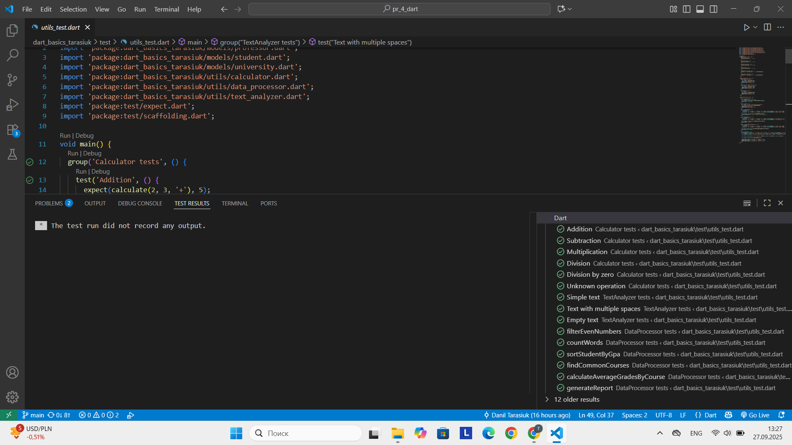

# Dart Practice

## 📌 Опис проекту
Цей проєкт реалізує серію навчальних завдань з мови програмування **Dart**.  
В ході виконання завдань реалізовані приклади роботи з:
- змінними, типами даних та функціями;
- об'єктно-орієнтованим програмуванням (класи, наслідування, поліморфізм);
- колекціями та обробкою даних;

Проєкт складається з кількох **консольних програм**, кожна з яких демонструє окремий аспект Dart.

## Встановлення Dart SDK
1. Завантажте та встановіть Dart SDK:  
   [https://dart.dev/get-dart](https://dart.dev/get-dart)

2. Перевірте встановлення:
   ```bash
   dart --version
3. Клонуйте репозиторій:
   git clone <>
   cd <>

## Опис завдань
### Завдання 2.1 – Технічні специфікації змінні та типи даних

Ця програма демонструє основи роботи з **змінними, типами даних та колекціями** у Dart.

#### Основні можливості:
1. **Числові типи (`int`, `double`, `num`)**  
   - Приклади створення змінних: `int a = 17; double b = 3.85; num c = 8;`  
   - Математичні операції: додавання, віднімання, множення, ділення, залишок, піднесення до степеня  
   - Конверсія типів: `int -> double`, `double -> int`

2. **Рядки (`String`)**  
   - Створення рядків та інтерполяція: `Hello, I'm $name!`  
   - Багаторядкові рядки та escape-послідовності  
   - Методи рядків: `length`, `toUpperCase()`, `toLowerCase()`, `contains()`, `replaceAll()`, `substring()`, `split()`

3. **Булеві значення (`bool`)**  
   - Логічні змінні: `true/false`  
   - Порівняння чисел: `==, !=, <, >, <=, >=`  
   - Логічні операції: `&&, ||, !`

4. **Колекції**  
   - `List`: додавання/видалення елементів, доступ до першого/останнього елементу, перевернутий список  
   - `Set`: унікальні елементи, додавання/видалення, перевірка наявності  
   - `Map`: ключ-значення, додавання елементів, отримання ключів та значень, перевірка наявності ключа

5. **Null Safety**  
   - Nullable типи: `String? nullableString`  
   - Null-aware оператори: `??`, `??=`  
   - Безпечний виклик методів: `name?.length`  
   - `late` змінні для відкладеної ініціалізації  
   - `required` параметри у функціях

### Завдання 2.2 – Технічні специфікації функцій

Ця програма демонструє використання **функцій у Dart**, включаючи базові, розширені, а також функціональне програмування та рекурсію.

#### Основні можливості:

1. **Базові функції**  
   - `calculateSum(int a, int b)` – обчислює суму двох чисел  
   - `calculateAverage(List<double> numbers)` – обчислює середнє значення списку чисел  
   - Використання функцій у демонстраційних викликах `testBasicFunctions()`

2. **Функції з optional та named параметрами**  
   - `formatName(String firstName, String lastName, {String? middleName, bool uppercase = false})`  
   - Показує формування повного імені з опціональним середнім ім’ям і можливістю виводу у верхньому регістрі

3. **Функції вищого порядку та closures**  
   - Використання `map` для обчислення квадратів чисел  
   - Використання `where` для відбору парних чисел  
   - Демонстрація closure через функцію `makeMultiplier(int factor)` для створення множників

4. **Рекурсивні функції**  
   - `fibonacci(int n)` – обчислення n-го числа Фібоначчі  
   - `factorial(int n)` – обчислення факторіалу числа

### Завдання 2.3 – Робочі консольні програми

Цей блок демонструє реалізацію **консольних додатків** на Dart. Мета – закріпити знання про змінні, типи даних та функції, а також навчитися обробляти введені дані.

---

#### 1. Калькулятор (`task1_calculator.dart`)

Програма дозволяє виконувати базові **математичні операції** над двома числами:

- Підтримувані операції: `+`, `-`, `*`, `/`  
- Обробка помилки ділення на нуль  
- Використання функції `calculate` для обчислення результату  

### 2. Текстовий аналізатор (`task2_text_analyzer.dart`)

Програма підраховує:

- Кількість **символів** у тексті (без пробілів)
- Кількість **слів**

Використовуються методи обробки рядків та регулярні вирази.

### Завдання 3.1 – Технічні специфікації University Management System (Student & Course)

У цьому завданні реалізовано класи Student та Course для **системи управління університетом**:

---

#### 1. Клас `Student`

**Особливості:**

- Зберігає інформацію про студента:
  - `id`, `firstName`, `lastName`, `birthDate`
  - Курси (`enrolledCourses`) та оцінки (`grades`)
- **Getters**:
  - `fullName` – повне ім'я студента
  - `age` – обчислення віку за датою народження
  - `gpa` – середній бал по всіх курсах
- **Методи**:
  - `enrollInCourse(courseId)` – запис на курс
  - `addGrade(courseId, grade)` – додавання оцінки (перевірка, чи студент зарахований)
  - `getPassedCourses()` – повертає список курсів, де оцінка ≥ 60
- Підтримка **JSON серіалізації**:
  - `toJson()` та `Student.fromJson()`

### 2. Клас `Course`

**Особливості:**

- Зберігає інформацію про курс:
  - `id`, `name`, `description`, `credits`, `instructor`
  - `prerequisites` – список курсів, що потрібно пройти перед записом

**Методи:**

- `hasPrerequisites()` – перевірка наявності prerequisities
- `canStudentEnroll(Student student)` – перевірка, чи студент може записатися на курс (оцінки ≥ 60 для prerequisities)
- Перевизначено `toString()` для зручного відображення

### 3.2 Технічні специфікації Advanced OOP: Класи `University`, `Person`, `Professor`

Цей розділ демонструє використання об’єктно-орієнтованого підходу для моделювання університету.

---

#### Клас `Person` (`lib/models/person.dart`)
Абстрактний базовий клас для представлення людей (студентів або професорів).

**Геттери:**
- `fullName` – повне ім’я
- `age` – вік
- `role` – абстрактний геттер для ролі

---

#### Клас `Professor` (`lib/models/professor.dart`)
Наслідується від `Person`. Додатково зберігає інформацію про професора та його курси.

**Методи:**
- `assignCourse(courseId)` – додати курс до викладацьких
- `removeCourse(courseId)` – видалити курс
- `toString()` – зручне відображення інформації про професора

### Клас `University`

Містить студентів, професорів та курси.

**Методи:**
- `addProfessor(professor)` – додати професора  
- `addStudent(student)` – додати студента  
- `removeStudent(studentId)` – видалити студента  
- `findStudentById(id)` – знайти студента за ID  
- `getStudentByCourse(courseId)` – список студентів курсу  
- `getAvailableCoursesForStudent(studentId)` – доступні курси для студента  
- `generateStatistics()` – статистика університету (кількість студентів, середній GPA, кількість курсів та професорів)  

### Завдання 3.3 – Object-Oriented System Demo

Ця програма демонструє створення **об’єктно-орієнтованої системи управління університетом** з використанням класів `Student`, `Professor`, `Course` та `University`.

#### Основні можливості:

1. **Створення університету**
   - Клас `University` містить списки студентів, професорів та курсів.
   - Можливість додавання та видалення студентів та професорів.

2. **Класи студентів (`Student`)**
   - Поля: `id`, `firstName`, `lastName`, `birthDate`, `enrolledCourses`, `grades`
   - Методи:  
     - `enrollInCourse(courseId)` – запис на курс  
     - `addGrade(courseId, grade)` – додавання оцінки  
     - `getPassedCourses()` – список успішно пройдених курсів  
   - Геттери: `fullName`, `age`, `gpa`

3. **Класи професорів (`Professor`)**
   - Поля: `id`, `firstName`, `lastName`, `birthDate`, `department`, `salary`, `taughtCourses`
   - Методи:  
     - `assignCourse(courseId)` – призначення курсу  
     - `removeCourse(courseId)` – видалення курсу

4. **Класи курсів (`Course`)**
   - Поля: `id`, `name`, `description`, `credits`, `instructor`, `prerequisites`
   - Методи:  
     - `hasPrerequisites()` – перевірка наявності попередніх курсів  
     - `canStudentEnroll(student)` – перевірка, чи студент може записатись на курс

5. **Реалізація демонстраційного сценарію**
   - Створення студентів та професорів  
   - Додавання курсів та присвоєння їх професорам  
   - Запис студентів на курси та додавання оцінок  
   - Вивід статистики університету, студентів, професорів та курсів

### Завдання 4.1 – Технічні специфікації Data Processing

Клас `DataProcessor` використовується для обробки даних студентів та університету. Містить статичні методи для аналізу, сортування та групування.

**Методи:**

- `filterEvenNumbers(List<int> numbers)` – повертає список парних чисел.  
- `countWords(String text)` – підраховує кількість повторень кожного слова в тексті.  
- `sortStudentByGpa(List<Student> students)` – сортує студентів за GPA у порядку спадання та повертає список мап із `id`, `fullName`, `GPA`.  
- `findCommonCourses(List<Student> students)` – повертає набір курсів, які відвідують усі студенти.  
- `groupStudentsByYear(List<Student> students)` – групує студентів за роком народження.  
- `calculateAverageGradesByCourse(List<Student> students)` – обчислює середню оцінку студентів для кожного курсу.  
- `generateReport(University university)` – генерує комплексний звіт по університету, включно зі студентами, професорами та курсами, з інформацією про середні оцінки, пройдені курси та викладачів.

### Завдання 4.2 – Технічні специфікації Collections Demo

Ця програма демонструє використання **колекцій Dart** (`List`, `Set`, `Map`) та обробку даних у контексті університетської системи.

#### Основні можливості:

1. **List**  
   - Фільтрація чисел (`filterEvenNumbers`)  
   - Сортування студентів за GPA (`sortStudentByGpa`)  
   - Демонстрація методів `map`, `where`  

2. **Set**  
   - Пошук спільних курсів серед усіх студентів (`findCommonCourses`)  

3. **Map**  
   - Підрахунок кількості слів у тексті (`countWords`)  
   - Групування студентів за роком народження (`groupStudentsByYear`)  
   - Обчислення середніх оцінок за курсами (`calculateAverageGradesByCourse`)  

4. **Advanced Operations / Генерація звітів**  
   - Використання класу `DataProcessor` для комплексної обробки даних університету  
   - Генерація звіту, що включає:
     - Інформацію про студентів, курси та оцінки  
     - Інформацію про професорів та курси, які вони викладають  
     - Підсумкові дані по курсах та середні оцінки

## Запуск програм
У проєкті деякі завдання реалізовані як **окремі Dart-скрипти** у папці `bin/`,  
інші — як **консольні програми/утиліти** у папці `lib/utils/`.
## Завдання 2.1 – Технічні специфікації змінні та типи даних
  dart run bin/task1_variables.dart
## Завдання 2.2 – Технічні специфікації функцій
  dart run bin/task2_functions.dart
## Завдання 2.3 – Робочі консольні програми
  #### 1. Калькулятор (`task1_calculator.dart`)
   dart run dart_basics_tarasiuk/lib/utils/calculator.dart
  #### 2. Текстовий аналізатор (`task2_text_analyzer.dart`)
   dart run dart_basics_tarasiuk/lib/utils/text_analyzer.dart
## Завдання 3.3 – ООП System Demo
  dart run bin/task3_classes.dart
## Завдання 4.2 – Технічні специфікації Collections Demo
  dart run bin/task4_collections.dart

## Результати виконання програм
### Завдання 2.1 – Технічні специфікації змінні та типи даних
  



*Файл: `task1_variables.dart`*

### Завдання 2.2 – Технічні специфікації функцій
  
*Файл: `task2_function.dart`*

### Завдання 2.3 – Робочі консольні програми
#### 1. Калькулятор (`task1_calculator.dart`)
  
*Файл: `calculator.dart`*

#### 2. Текстовий аналізатор (`task2_text_analyzer.dart`)
  
*Файл: `text_analyzer.dart`*

### Завдання 3.3 – ООП System Demo

  
*Файл: `task3_classes.dart`*

### Завдання 4.2 – Технічні специфікації Collections Demo
  
  
*Файл: `task4_collections.dart`*

## Результати виконання тестів
### Models Test
  
*Файл: `models_test.dart`*

### Utils Test
  
*Файл: `utils_test.dart`*


